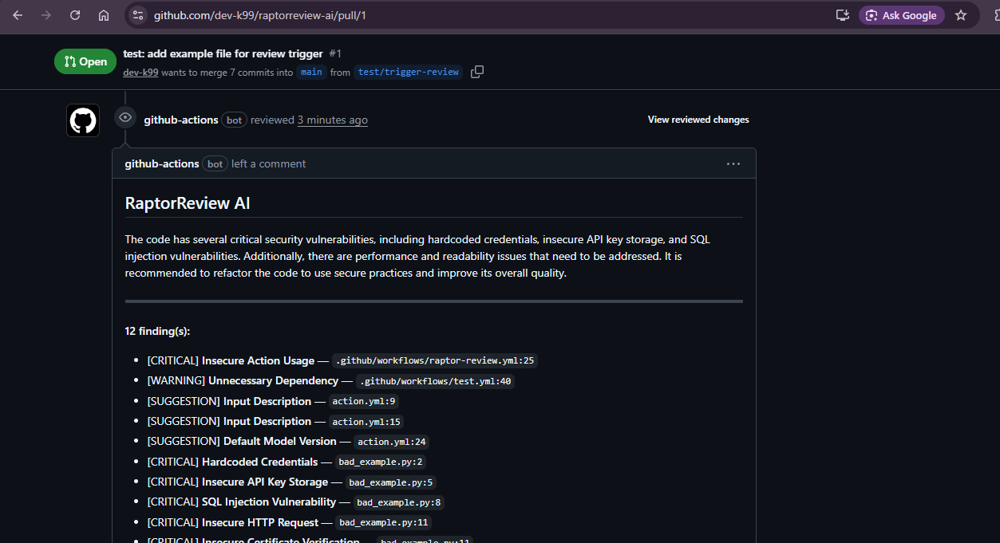

# RaptorReview AI

[](https://github.com/dev-k99/raptorreview-ai/actions/workflows/test.yml)
[](LICENSE)
[](https://groq.com)
[](https://github.com/marketplace/actions/raptorreview-ai)
[](https://github.com/dev-k99/raptorreview-ai)

A GitHub Action that reviews every pull request using Groq's free-tier LLM inference. It posts structured, line-specific review comments directly in the PR interface — security vulnerabilities, performance issues, readability problems, missing tests — without any paid API, hosted service, or infrastructure.

---



---

## What it does

- Diffs each PR against its base branch with `git diff origin/<base>...HEAD`
- Filters out noise files (lock files, minified assets, generated code) before sending to the model
- Counts tokens accurately with `tiktoken` and truncates at the 3,000-token budget
- Sends the diff to Groq and enforces a strict JSON response schema
- Posts an overall review summary with a categorised finding list
- Posts inline comments on the exact changed lines where issues were found
- Snaps misaligned line numbers to the nearest valid diff position (within 5 lines)
- Escalates severity automatically for files listed in `CODEOWNERS`
- Falls back through a model chain if the primary model is unavailable
- Appends a stats footer to every review: files reviewed, lines changed, model used, token count
- Exits 0 always — a review failure never blocks your CI pipeline

---

## Quickstart

### 1. Add the workflow file

Create `.github/workflows/raptor-review.yml`:

```yaml
name: RaptorReview AI

on:
  pull_request:
    types: [opened, synchronize, reopened]

permissions:
  contents: read
  pull-requests: write

jobs:
  review:
    runs-on: ubuntu-latest
    steps:
      - uses: actions/checkout@v4
        with:
          fetch-depth: 0

      - uses: dev-k99/raptorreview-ai@v1
        with:
          groq_api_key: ${{ secrets.GROQ_API_KEY }}
```

### 2. Add your Groq API key

Get a free key at [console.groq.com](https://console.groq.com). Add it to your repository:

**Settings → Secrets and variables → Actions → New repository secret**

| Field | Value |
|-------|-------|
| Name  | `GROQ_API_KEY` |
| Secret | your Groq key |

### 3. Open a pull request

RaptorReview posts its review automatically on every PR open, push, or reopen. No further configuration required.

---

## Configuration

All inputs are optional except `groq_api_key`.

| Input | Default | Description |
|-------|---------|-------------|
| `groq_api_key` | — | **Required.** Groq API key. Pass via `${{ secrets.GROQ_API_KEY }}`. |
| `github_token` | `${{ github.token }}` | GitHub token for posting comments. The default is sufficient with `pull-requests: write`. |
| `model` | `llama-3.3-70b-versatile` | Primary Groq model. Falls back to `llama-3.1-8b-instant` then `gemma2-9b-it` automatically. |
| `temperature` | `0.2` | Sampling temperature `[0.0, 1.0]`. Lower values produce more consistent output. |
| `max_tokens` | `2048` | Maximum tokens in the model response. Increase if reviews are cut short on large diffs. |
| `custom_prompt` | — | Fully replace the system prompt. Useful for enforcing language- or domain-specific rules. |

**Example with all inputs:**

```yaml
- uses: dev-k99/raptorreview-ai@v1
  with:
    groq_api_key:  ${{ secrets.GROQ_API_KEY }}
    model:         "llama-3.3-70b-versatile"
    temperature:   "0.1"
    max_tokens:    "3000"
    custom_prompt: "You are a Go expert. Focus on goroutine safety and interface misuse."
```

---

## How it works

```
Pull Request opened / pushed / reopened
              |
              v
   git diff origin/<base>...HEAD
              |
              v
   filter_diff()
   Strip lock files, minified assets,
   generated code (SKIP_PATTERNS)
              |
              v
   truncate_diff()
   tiktoken token count → cut at 3,000
   tokens on a line boundary if needed
              |
              v
   call_groq()  [model fallback chain]
   llama-3.3-70b-versatile
     → llama-3.1-8b-instant
       → gemma2-9b-it
              |
              v
   Parse JSON  { file, line, severity,
                 title, suggestion, why }
              |
              v
   apply_codeowners_boost()
   Escalate severity for owned paths
              |
              v
   POST /pulls/:id/reviews
   Summary body + inline comments
   snapped to valid diff lines
              |
              v
   Exit 0  (CI always unblocked)
```

The model is prompted to return a strict JSON schema — no markdown, no freeform text — so the response is always machine-parseable. If Groq is unavailable for any reason, the action posts a plain fallback comment and exits cleanly.

---

## Review output

Each review consists of:

**Summary comment** — an overall assessment followed by a categorised finding list:

```
[CRITICAL] Hardcoded Credentials       — bad_example.py:2
[CRITICAL] SQL Injection Vulnerability — bad_example.py:8
[WARNING]  Inefficient List Operation  — bad_example.py:18
[SUGGESTION] Missing Input Validation  — bad_example.py:22

Reviewed 3 file(s) · +47 -12 · Model: llama-3.3-70b-versatile · Tokens: ~1,840
```

**Inline comments** — posted directly on the changed lines, each containing the issue title, impact explanation, and a concrete suggested fix.

---

## Security

- Code diffs are transmitted to Groq's API. Review [Groq's privacy policy](https://groq.com/privacy-policy) before enabling this on repositories containing regulated or sensitive data.
- `GROQ_API_KEY` is consumed as an environment variable and never appears in log output.
- The workflow uses the minimum required permissions: `contents: read` and `pull-requests: write`. No other scopes are requested or granted.
- The action always exits with code 0. A review failure will never block a merge or break a build.

---

## Limitations

- Diffs larger than ~3,000 tokens are truncated. The truncation point and a note are included in the review body. Prefer smaller, focused PRs for complete coverage.
- Inline comment line numbers are provided by the model. If a suggested line is not present in the diff hunk, the comment appears in the summary list instead.
- This is a first-pass automated review. It surfaces common issues quickly; human review still makes the final call.

---

## Roadmap

- [ ] Configurable minimum severity threshold (suppress suggestions below a set level)
- [ ] Hugging Face Inference API as a drop-in alternative provider
- [ ] PR description quality check as an optional second pass
- [ ] Comment deduplication across successive pushes to the same PR

---

## Development

```bash
git clone https://github.com/dev-k99/raptorreview-ai.git
cd raptorreview-ai
pip install -r requirements.txt
pip install ruff

# Lint
ruff check src/

# Smoke test (no API calls)
PYTHONPATH=src python -c "import review; print('OK')"
```

The test workflow ([.github/workflows/test.yml](.github/workflows/test.yml)) runs `ruff check` and the import smoke test on every push and pull request targeting `main`.

---

## Contributing

1. Fork the repository
2. Create a feature branch off `main`
3. Ensure `ruff check src/` passes with zero warnings
4. Open a pull request — RaptorReview AI will review it automatically

---

## License

MIT — see [LICENSE](LICENSE).
